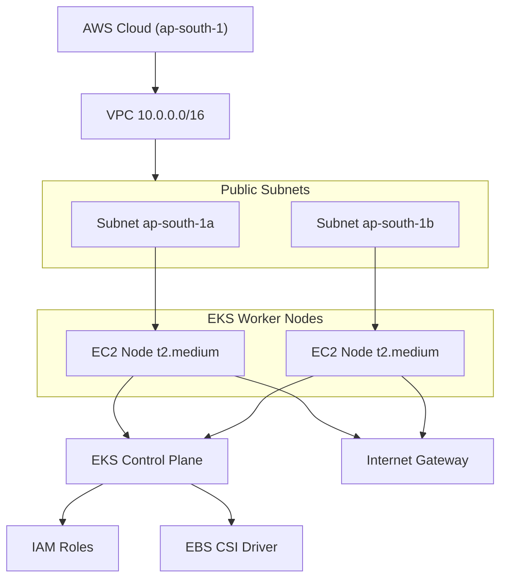

# EKS-Terraform

## Notes 

- The VPC provides isolated networking for the EKS cluster.

- Two public subnets across different AZs ensure high availability.

- EKS Control Plane is fully managed by AWS.

- Worker nodes (EC2) run Kubernetes pods.

- IAM roles provide secure AWS permissions.

- EBS CSI Driver enables persistent storage for Kubernetes workloads.

- Internet Gateway allows nodes to pull container images and updates.
