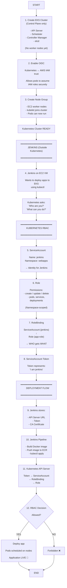

```mermaid
flowchart TD
    A[START]
    
    A --> B["1. Create EKS Cluster
    (Control Plane only)
    
    - API Server
    - Scheduler
    - Controller Manager
    - etcd
    
    (No worker nodes yet)"]
    
    B --> C["2. Enable OIDC
    
    Kubernetes ↔ AWS IAM trust
    
    Allows pods to assume
    IAM roles securely"]
    
    C --> D["3. Create Node Group
    
    - EC2 worker nodes
    - kubelet joins cluster
    - Pods can now run"]
    
    D --> E[Kubernetes Cluster READY]
    
    E --> F["━━━━━━━━━━━━━━━━━━━━━━
    JENKINS (Outside Kubernetes)
    ━━━━━━━━━━━━━━━━━━━━━━"]
    
    F --> G["4. Jenkins on EC2 VM
    
    Wants to deploy apps to EKS
    using kubectl"]
    
    G --> H["Kubernetes asks:
    'Who are you?'
    'What can you do?'"]
    
    H --> I["━━━━━━━━━━━━━━━━━━━━━━
    KUBERNETES RBAC
    ━━━━━━━━━━━━━━━━━━━━━━"]
    
    I --> J["5. ServiceAccount
    
    Name: jenkins
    Namespace: webapps
    
    → Identity for Jenkins"]
    
    J --> K["6. Role
    
    Permissions:
    - create / update / delete
    - pods, services,
      deployments
    
    (Namespace-scoped)"]
    
    K --> L["7. RoleBinding
    
    ServiceAccount (jenkins)
           ↓
    Role (app-role)
    
    → WHO gets WHAT"]
    
    L --> M["8. ServiceAccount Token
    
    Token represents:
    'I am jenkins'"]
    
    M --> N["━━━━━━━━━━━━━━━━━━━━━━
    DEPLOYMENT FLOW
    ━━━━━━━━━━━━━━━━━━━━━━"]
    
    N --> O["9. Jenkins stores:
    
    - API Server URL
    - Token
    - CA Certificate"]
    
    O --> P["10. Jenkins Pipeline
    
    - Build Docker image
    - Push image to ECR
    - kubectl apply"]
    
    P --> Q["11. Kubernetes API Server
    
    Token → ServiceAccount
           → RoleBinding
           → Role"]
    
    Q --> R{"12. RBAC Decision
    
    Allowed?"}
    
    R -->|YES| S["Deploy app
    
    Pods scheduled on nodes
    
    Application LIVE 🎉"]
    
    R -->|NO| T[Forbidden ❌]
    
    S --> U[END]
    T --> U
```
