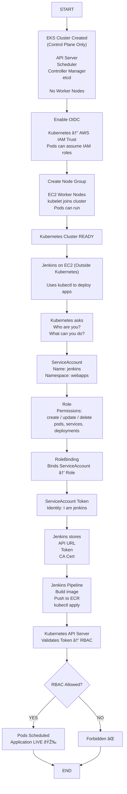

```mermaid
flowchart TD
    A[START]

    A --> B["EKS Cluster Created
    (Control Plane Only)
    
    API Server
    Scheduler
    Controller Manager
    etcd
    
    No Worker Nodes"]

    B --> C["Enable OIDC
    
    Kubernetes ↔ AWS IAM Trust
    Pods can assume IAM roles"]

    C --> D["Create Node Group
    
    EC2 Worker Nodes
    kubelet joins cluster
    Pods can run"]

    D --> E[Kubernetes Cluster READY]

    E --> F["Jenkins on EC2 (Outside Kubernetes)
    
    Uses kubectl to deploy apps"]

    F --> G["Kubernetes asks
    Who are you?
    What can you do?"]

    G --> H["ServiceAccount
    Name: jenkins
    Namespace: webapps"]

    H --> I["Role
    Permissions:
    create / update / delete
    pods, services, deployments"]

    I --> J["RoleBinding
    Binds ServiceAccount → Role"]

    J --> K["ServiceAccount Token
    Identity: I am jenkins"]

    K --> L["Jenkins stores
    API URL
    Token
    CA Cert"]

    L --> M["Jenkins Pipeline
    Build image
    Push to ECR
    kubectl apply"]

    M --> N["Kubernetes API Server
    Validates Token → RBAC"]

    N --> O{RBAC Allowed?}

    O -->|YES| P["Pods Scheduled
    Application LIVE 🎉"]
    O -->|NO| Q[Forbidden âŒ]

    P --> R[END]
    Q --> R[END]
```
